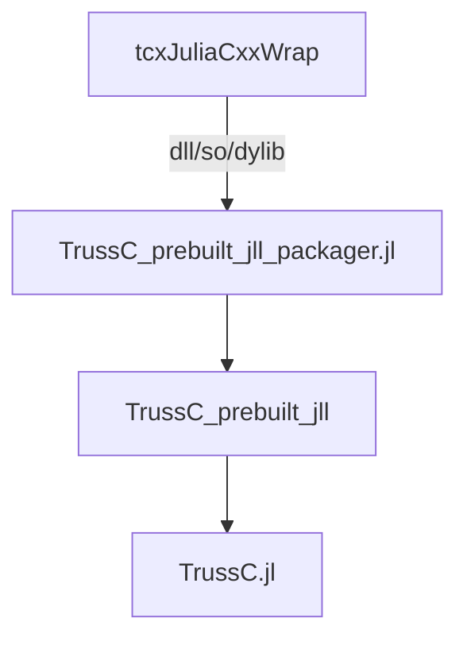
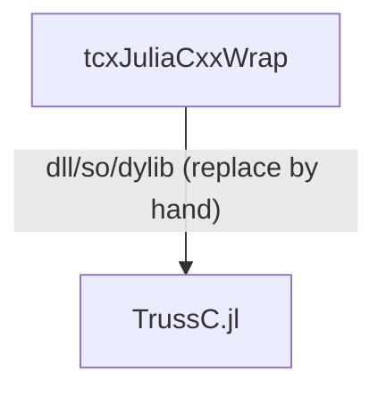

# Build notes

## Current build process

1. Build dll/so/dylib by [tcxJuliaCxxWrap](https://github.com/funatsufumiya/tcxJuliaCxxWrap/) (In Win/Mac/Linux, this process is now manually done.)
2. Put dll/so/dylib into [TrussC_prebuilt_jll_packager.jl](https://github.com/funatsufumiya/TrussC_prebuilt_jll_packager.jl), then publish them into [Releases](https://github.com/funatsufumiya/TrussC_prebuilt_jll_packager.jl/releases) using [`create_releases.sh`](https://github.com/funatsufumiya/TrussC_prebuilt_jll_packager.jl/blob/main/create_releases.sh)
3. Update Artifacts.toml of [TrussC_prebuilt_jll](https://github.com/funatsufumiya/TrussC_prebuilt_jll) using [`gen_artifacts.sh`](https://github.com/funatsufumiya/TrussC_prebuilt_jll_packager.jl/blob/main/gen_artifacts.sh), then update version number of [Project.toml](https://github.com/funatsufumiya/TrussC_prebuilt_jll/blob/main/Project.toml), and `julia --project=@. -e 'using Pkg; Pkg.update(); Pkg.instantiate()'` and update TrussC_prebuilt_jll.
4. In [TrussC.jl](https://github.com/funatsufumiya/TrussC.jl), update version number of [Project.toml](https://github.com/funatsufumiya/TrussC_prebuilt_jll/blob/main/Project.toml), and `julia --project=@. -e 'using Pkg; Pkg.update(); Pkg.instantiate()'` and update TrussC.jl
   - Please modify [src/TrussC.jl](https://github.com/funatsufumiya/TrussC.jl/blob/main/src/TrussC.jl) if needed, such as Base operator overloads and exports.
   - Check test cases using `julia --project=@. -e 'using Pkg; Pkg.test()'`

## For handy development (shorthand dll override)

The build process above is a little hard to test interactive binding changes of [tcxJuliaCxxWrap](https://github.com/funatsufumiya/tcxJuliaCxxWrap/).

So for development, we are using shorthand dll override process (for test only).

1. First, initialize [TrussC.jl](https://github.com/funatsufumiya/TrussC.jl) .
2. Then, `julia --project=@. -e 'using TrussC_prebuilt_jll; println(TrussC_prebuilt_jll.get_lib_path())'` prints current `libJlTrussC.dll` (or so/dylib) path.
3. Update dll/so/dylib from [tcxJuliaCxxWrap](https://github.com/funatsufumiya/tcxJuliaCxxWrap/), then modify (override) the dll printed above by hand.
   - Then modify [src/TrussC.jl](https://github.com/funatsufumiya/TrussC.jl/blob/main/src/TrussC.jl) if needed, such as Base operator overloads and exports.
   - Check test cases using `julia --project=@. -e 'using Pkg; Pkg.test()'`

> [!Note]
> This shorthand process is only for development. If all completed, please execute the original process in order to apply it in published artifacts.